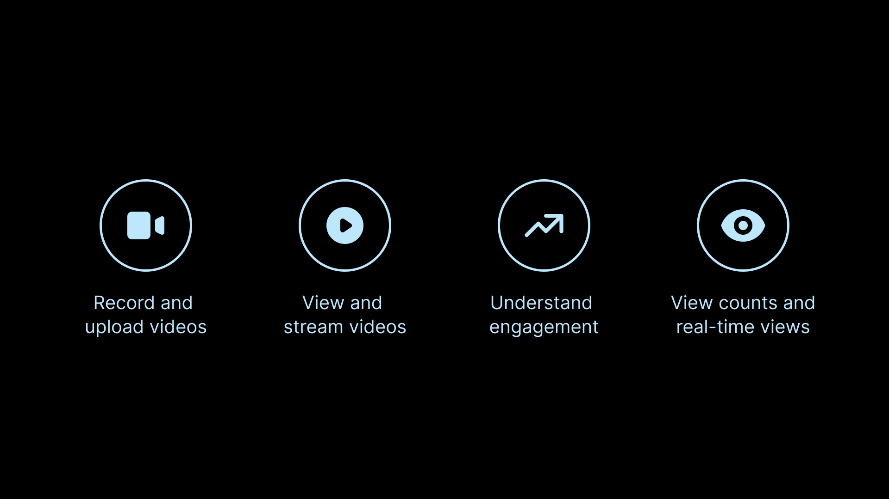
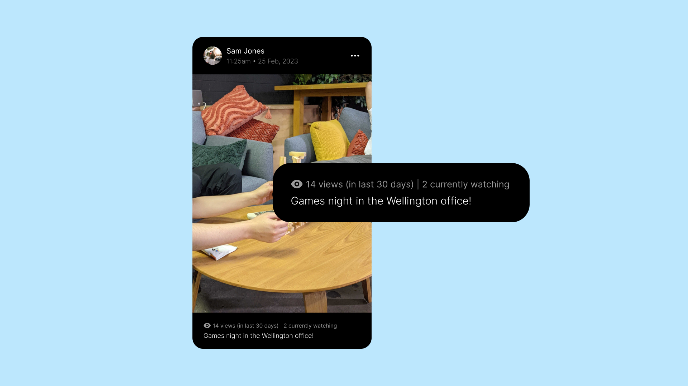
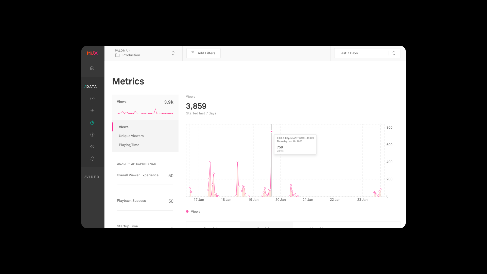
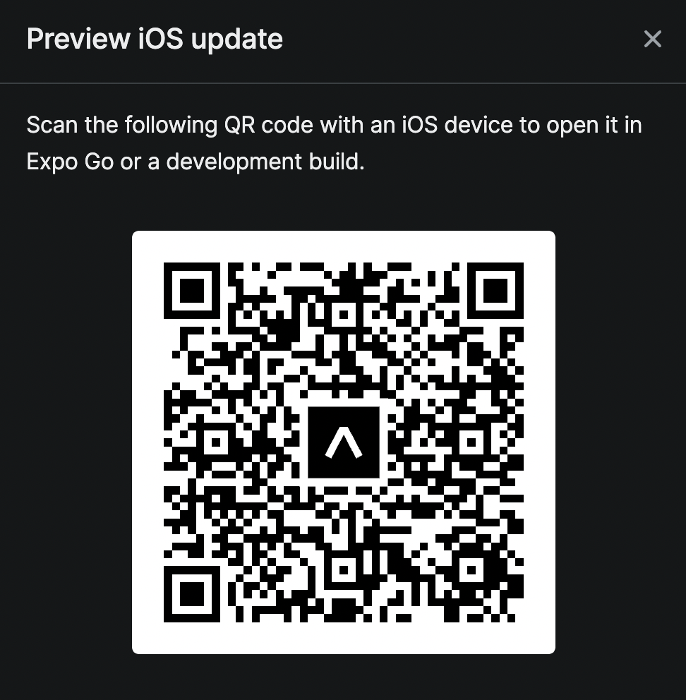
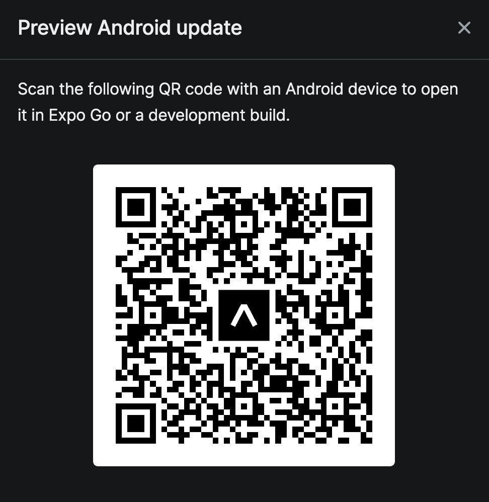

<!-- Improved compatibility of back to top link: See: https://github.com/othneildrew/Best-README-Template/pull/73 -->
<a name="readme-top"></a>


<!-- PROJECT LOGO -->
<br />
<div align="center">

<h3 align="left">Pals</h3>

  <p align="left">
 A social sharing app that focuses on connecting remote workplace teams through short-form video recording and sharing.
    <br />
    <br />
    This project uses the <a href="https://mux.com"><strong>Mux.com</strong></a> Video and Data APIs in order to showcase what they can do!
    <br />
    <br />
    Coming soon ... blog post on Mux.com 📝 🔥
    <br />
    <br />
    <a href="https://github.com/paloma-group/muxpudding/issues">Report Bug</a>
    ·
    <a href="https://github.com/paloma-group/muxpudding/issues">Request Feature</a>
  </p>
</div>


<!-- SCREENSHOTS -->

## Screenshots of the app

<div align='left'>





</div>

<p align="right">(<a href="#readme-top">back to top</a>)</p>

## Built With

* React Native - Expo
* Mux
  * Video API - handles direct uploads of video files and streaming videos
  * Mux Data API - view metrics such as real-time watch count and total view counts 
* Firebase
    * Firestore a NoSQL database
    * Google Sign-in for Authentication
    * Cloud Functions for backend-as-a-service
* Tailwind CSS via the React Native library `twrnc`

<p align="right">(<a href="#readme-top">back to top</a>)</p>


<!-- GETTING STARTED -->

## Getting Started

### Prerequisites

This requires expo CLI to be installed

* expo CLI
  ```sh
  npx expo -h
  ```

### Installation


1. Clone the repo
   ```sh
   git clone https://github.com/paloma-group/muxpudding.git
   ```
2. Inside `/frontend` folder install NPM packages
   ```sh
   npm install
   ```
3. Run expo
   ```js
   npx expo start
   ```

<p align="right">(<a href="#readme-top">back to top</a>)</p>


<!-- MARKDOWN LINKS & IMAGES -->
<!-- https://www.markdownguide.org/basic-syntax/#reference-style-links -->

[contributors-shield]: https://img.shields.io/github/contributors/othneildrew/Best-README-Template.svg?style=for-the-badge

[contributors-url]: https://github.com/othneildrew/Best-README-Template/graphs/contributors

[forks-shield]: https://img.shields.io/github/forks/othneildrew/Best-README-Template.svg?style=for-the-badge

[forks-url]: https://github.com/othneildrew/Best-README-Template/network/members

[stars-shield]: https://img.shields.io/github/stars/othneildrew/Best-README-Template.svg?style=for-the-badge

[stars-url]: https://github.com/othneildrew/Best-README-Template/stargazers

[issues-shield]: https://img.shields.io/github/issues/othneildrew/Best-README-Template.svg?style=for-the-badge

[issues-url]: https://github.com/othneildrew/Best-README-Template/issues

[license-shield]: https://img.shields.io/github/license/othneildrew/Best-README-Template.svg?style=for-the-badge

[license-url]: https://github.com/othneildrew/Best-README-Template/blob/master/LICENSE.txt

[linkedin-shield]: https://img.shields.io/badge/-LinkedIn-black.svg?style=for-the-badge&logo=linkedin&colorB=555

[linkedin-url]: https://linkedin.com/in/othneildrew

[product-screenshot]: frontend/assets/welcome-screen.png

[Next.js]: https://img.shields.io/badge/next.js-000000?style=for-the-badge&logo=nextdotjs&logoColor=white

[Next-url]: https://nextjs.org/

[React.js]: https://img.shields.io/badge/React-20232A?style=for-the-badge&logo=react&logoColor=61DAFB

[React-url]: https://reactjs.org/

[Vue.js]: https://img.shields.io/badge/Vue.js-35495E?style=for-the-badge&logo=vuedotjs&logoColor=4FC08D

[Vue-url]: https://vuejs.org/

[Mux-url]: https://mux.com/

[ReactNative-url]: https://reactnative.dev/

[ReactNative.js]: https://img.shields.io/badge/-ReactNative-61DAFB?logo=react&logoColor=white&style=for-the-badge

[Angular.io]: https://img.shields.io/badge/Angular-DD0031?style=for-the-badge&logo=angular&logoColor=white

[Angular-url]: https://angular.io/

[Svelte.dev]: https://img.shields.io/badge/Svelte-4A4A55?style=for-the-badge&logo=svelte&logoColor=FF3E00

[Svelte-url]: https://svelte.dev/

[Laravel.com]: https://img.shields.io/badge/Laravel-FF2D20?style=for-the-badge&logo=laravel&logoColor=white

[Laravel-url]: https://laravel.com

[Bootstrap.com]: https://img.shields.io/badge/Bootstrap-563D7C?style=for-the-badge&logo=bootstrap&logoColor=white

[Bootstrap-url]: https://getbootstrap.com

[JQuery.com]: https://img.shields.io/badge/jQuery-0769AD?style=for-the-badge&logo=jquery&logoColor=white

[JQuery-url]: https://jquery.com 
